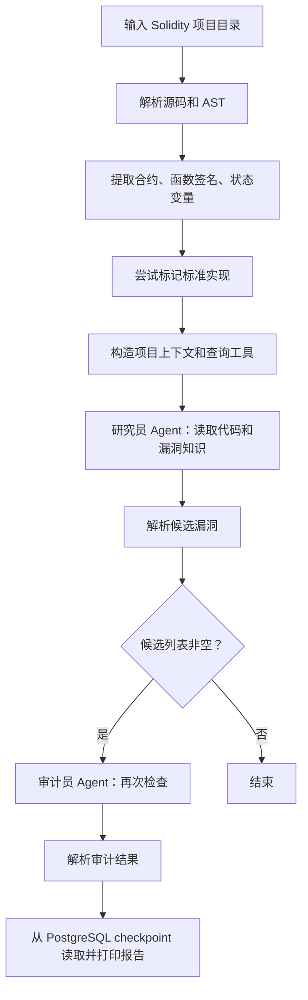

大致流程

## Todo

1. 多agent设计: 模型配置: temperature/prompt, skills, harness

2. 合约读取, 路径规范化和错误分支("分析失败" != "没有出现漏洞"提示优化)

3. 测试集与 baseline (沙箱测试未被收录进基模数据集的最新案例) (基模 / 单 agent / 多 agent / 多agent + checklist)

4. 持久化记忆优化, thought buffer

## Q
多agent检测的时候 会不会出现一个agent检测错误 然后把另一个检测对的说服了（x

(by the way:当问deepseek和gpt redis是ap还是cp, 给出https://redis.io/docs/latest/operate/oss_and_stack/reference/cluster-spec/#write-safety 时, gpt被说服从ap改为cp, deepseek仍觉得是ap)
(互联网上说redis是ap 个人实际上感觉redis ac都做不到, redis node 会根据 key 去算查询应该落在哪个 node，不是自己就只会路由查询，单个 node 上根本就没有全量数据，availability就很糟糕了)