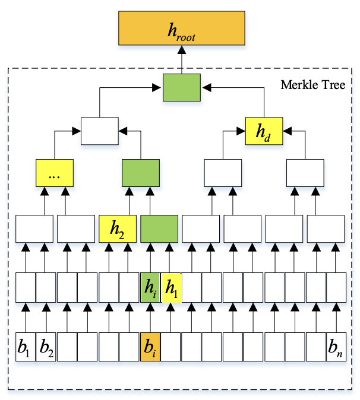

# zkAssetRaffle: A Verifiable Raffle Protocol for Real-World Assets

- [update]: We are happy to announce that zkAssetRaffle won the first prize in the public goods track at Eth Beijing Hackathon🎉

> A decentralized, transparent, and tamper-proof raffle system that bridges physical products and on-chain verification.

# Introduction
In daily consumption scenarios, merchants often use raffles to attract users. However, these activities are often "black boxes." Users cannot verify the fairness of the prizes, and merchants can arbitrarily change the winning rate. This lack of transparency severely damages user trust and reduces participation.

At the same time, while blockchain technology can provide transparency and verifiability, it remains challenging to link a massive number of real-world assets (RWA) — such as beverages, takeout, or daily goods — to on-chain credentials while ensuring fairness and privacy.

To mitigate this gap, we design zkAssetRaffle, a decentralized, fair, and verifiable raffle protocol specifically designed for Real-World Assets (RWA). This protocol enables merchants to conduct fair and verifiable raffle events tied to physical products (e.g., beverages, food products, luxuries) using encrypted QR codes. It allows merchants to easily generate unique raffle encrypted QR codes for each product, while ensuring that:

(1) Fairness: Winning information is generated in a confidential environment, making it impossible for merchants to predict or alter the outcome.

(2) Privacy: Zero-knowledge proof protects the confidentiality of winning information.

(3) Verifiability: Anyone can verify the winning information and fairness on-chain.

With this design, zkAssetRaffle is expected to bring the vast array of goods and users from everyday consumption scenarios onto the blockchain, becoming a potential pathway for achieving mass adoption of Web3.

# A Brief Illustration of the Entire Process
Stage I: Generate Commitment and Encrypted QR Codes. The merchant sets the activity information, and zkAssetRaffle generates encrypted QR codes in a confidential environment (such as TEE).

Stage II: On-Chain Claim. Users scan the QR codes and sign transactions to register for raffles.

Stage III: Reveal Commitment and Settle Rewards. After the designated period, zkAssetRaffle publicly discloses the decryption key and zk proofs. Anyone can verify the winning information and claim rewards.

----------

# zkAssetRaffle Design Details
## Step 1: Offline QR Code Generation
- Random Salt (`r_i`): A unique random value is generated for each QR code.
- Commitment (`leaf_i`): Calculated using the formula: 
  - sid_i: The unique serial identifier for the product.
  - r_i: The randomly generated salt for that product.
  - win_i: The encoded winning status for that product.
$$\mathrm{leaf}_i = \mathrm{keccak256}(sid_i || r_i || win_i)$$
- Merkle Root Commitment: All $\mathrm{leaf}_i$ values are aggregated into a Merkle Tree, and the Merkle Root is published on-chain. This ensures the integrity and immutability of the winning information without revealing any individual outcomes. Constraints in the zk circuit ensure that the prize is exactly what the merchant claims.

Each product is tagged with a QR code containing:
- $\mathrm{sid}_i$: The product's serial identifier.
- $C_i$: The encrypted form of the winning information, calculated as: $$C_i = Encryption_{key}(r_i || win_i)$$
- The secret key (key) used for encryption is securely stored and only revealed during the reward claim phase. This can be achieved through private key sharding and secret sharing techniques

**Key Properties**: 
- The merchant cannot determine which QR codes are winning before the reveal.
- The encryption ensures that the winning status remains confidential.

## Step 2: On-Chain Registration
During this phase, users who have purchased a product can scan the QR code and register their participation in the raffle on-chain.

The user scans the QR code and retrieves:
- $\mathrm{sid}_i$: The serial identifier.
- $C_i$: The encrypted winning information.

The user submits a transaction to the smart contract, calling the claim() function, providing: $(\mathrm{sid}_i,C_i)$

The user's claim is recorded on-chain, but the actual winning status ($\mathrm{win}_i$) is still encrypted and unknown.

## Step 3: Reveal Commitment and Settle Rewards
After the claim period has ended, zkAssetRaffle protocol initiates the final phase by publicly revealing the decryption key.

Any user (including the claimed participants) can now decrypt the encrypted value:

$$r_i,\mathrm{win}_i=\mathrm{Decryption}_{key}(C_i)$$

$$Verify MerkleProof(\mathrm{keccak256}(\mathrm{sid}_i,r_i,\mathrm{win}_i),merklepath,Root)$$

## Repository Layout (Monorepo)
- `apps/frontend`: Next.js app (UI, wallet connection, QR scan/claim, admin console)
- `apps/api`: Fastify + tRPC API server (activity creation, item storage, Merkle data, reveal)
- `contracts/sol`: Solidity contracts (EVM raffle logic)
- `contracts/move`: Move contracts (WIP)
- `packages/crypto`: Crypto utilities (hashing, Merkle tree, AES helpers)
- `packages/trpc`: Shared tRPC router definitions
- `packages/types`: Shared types
- `packages/sdk`: Client SDK wrapper for tRPC
- `contracts/scripts`: Deployment scripts (Foundry)
- `contracts/out`: Foundry build artifacts

## Blockchain Support
zkAssetRaffle is designed to be chain-agnostic, with an EVM implementation in production and a Move implementation in progress.

- EVM networks supported by the frontend:
  - Sepolia (Ethereum)
  - Mantle Sepolia Testnet
  - Arbitrum Sepolia
- Move contracts: `contracts/move`

### Chain Configuration
Set addresses and RPC endpoints in `apps/frontend/.env`:
- `NEXT_PUBLIC_*_RAFFLE_CONTRACT_ADDRESS`
- `NEXT_PUBLIC_*_RPC_URL`

For deployments and verification, use `contracts/.env`:
- `MANTLE_SEPOLIA_TESTNET_RPC_URL`
- `ARBITRUM_SEPOLIA_RPC_URL`
- `ARBISCAN_API_KEY`

## Key Capabilities
RWA / RealFi: zkAssetRaffle treats physical goods as verifiable participation units. Each product is mapped to a QR-bound identity and a committed leaf, which allows merchants to bridge offline inventory and on-chain provenance without tokenizing the item itself. This provides a pragmatic RealFi path: merchants get measurable engagement and settlement guarantees, while users can verify fairness without needing specialized custody or complex asset issuance.

ZK & Privacy: The protocol uses commit-reveal with encrypted payloads and Merkle proofs to keep outcomes private until disclosure. It protects participant privacy by avoiding public exposure of winning status while still enabling public verification of integrity. The design is compatible with selective disclosure patterns and can be extended to ZK-KYC or compliance attestations without leaking sensitive data.

Infrastructure & Tooling: The project ships as a full-stack, developer-ready monorepo with shared crypto utilities, typed tRPC contracts, and an SDK layer. It includes operational primitives for activity creation, item storage, proof generation, and redemption, plus deployment scripts for EVM chains. This makes it straightforward to integrate into merchant systems or build dashboards and plugins on top.

## Development Quickstart
- All services (frontend + API): `pnpm dev`
- Frontend only: `pnpm dev:frontend`
- API (Node) only: `pnpm dev:api`
  - Frontend tRPC URL: `NEXT_PUBLIC_TRPC_URL` (default `http://localhost:5002/trpc`)

## Postgres (Local via Docker)
- Start: `docker compose up -d`
- Stop: `docker compose down`
- Reset data: `docker compose down -v`

After Postgres is up:
- Generate Prisma client: `pnpm -C apps/api prisma:generate`
- Run migrations: `pnpm -C apps/api prisma:migrate`
